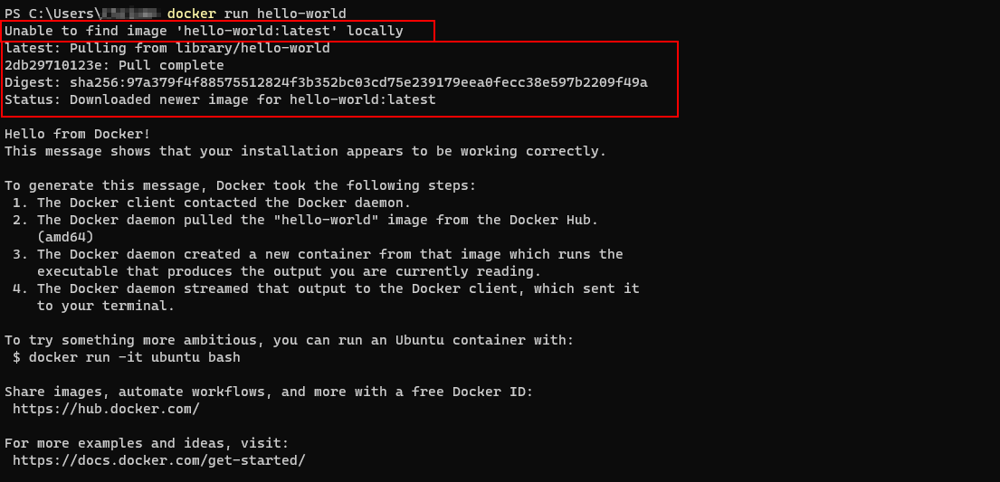
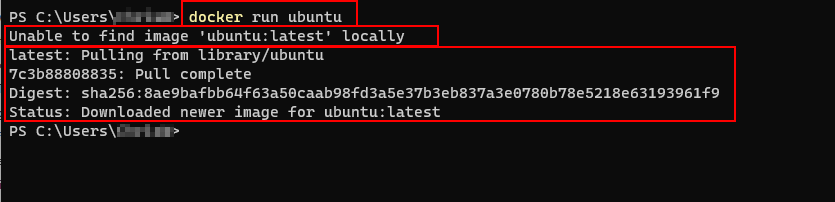
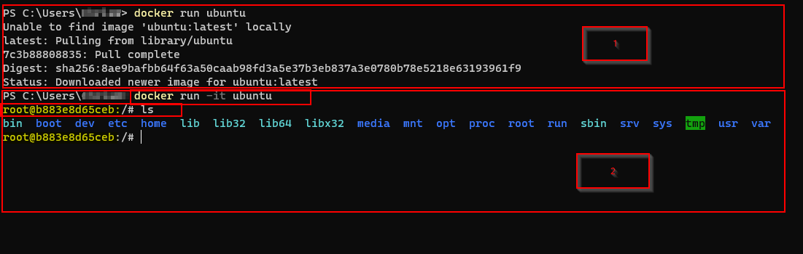

# Basic Docker Container

To confirm the Docker has been installed correctly , run : ```docker version``` from your terminal. This will display the installed version of the client and the docker server.

From the terminal run : ```docker run hello-world```
- This will check your local PC for the ___Docker Image___, if it does not find the ___hello_world___ image on your PC, it will download the latest version from Docker Hub.
- Please ensure you have a [Docker Hub account(https://hub.docker.com/)] and that you are loggged in with the Docker Client, otherwise you will get an Error
- Once the image has been downloaded the image will execute and then terminate. 
- If you run ```docker run hello-world``` a second time, it will run the image from your local PC





Running ```docker run hello-world``` demonstrates a basic example of Docker and other than confirming the installation does not do much. Lets create an Ubuntu Container by running ```docker run ubuntu```

As with the previous example it will check your local PC for the ___Ubuntu Image___ and if it does not find it locally it will download the latest version from ___Docker Hub___
After Docker has run the container it will exit the container because there are no Processes running inside the container. 

You can confirm that no containers are running by checking the Docker Client or by running ```docker ps``` from your Terminal.

```docker ps``` lists all running containers
If you run ```docker ps -a``` it will list a history of containers that were run and their status.

Running ```docker images```will list the images that have been downloaded, in our case ___hello-world___ and ___ubuntu___

The advantage of this is that if we need to create an image or download an image that uses ___Ubuntu___, docker will use the downloaded version of ___Ubuntu___ and not download it from ___Docker Hub___




If you run ```docker run -it ubuntu```
You will create a new container based on the ubuntu image that has been created but the container will not be exited as you are connecting directly to the container and running the bash shell from inside the container with the root account. From  here you can execute commands inside the container, e.g: ```ls``` to list all directory content inside the container.

If you run ```docker ps``` you can confirm the container is still running.

If you type ```exit```from Bash Shell, you will exit the container and the container will be shut down as there are no processes running inside the container.





[Back](ReadMe.md)