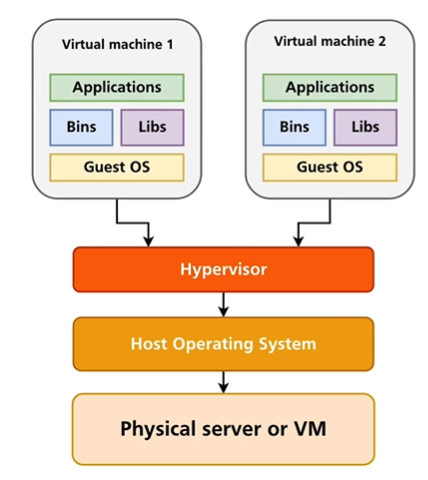
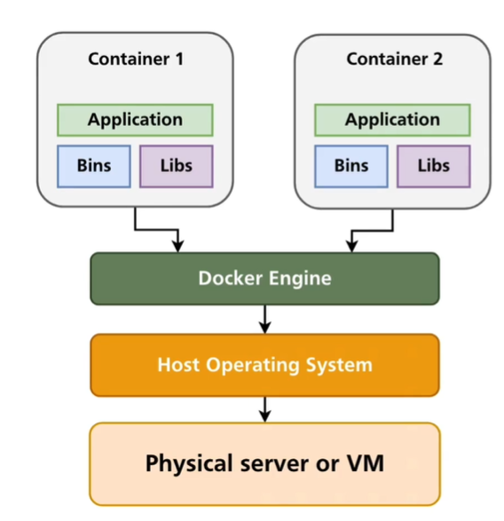

## Virtual Machines vs Docker

A Virtual Machine or VM is a virtual computer that has a dedicated Hard Drive, Memory, Processor and Network interface, similar to a Physical PC. Additionally a Virtual Machine Includes a Guest Operating System such as Windows, Linux or Mac OS. 
A Virtual Machines runs on a Physical Machine which includes a Host Operating System and Hypervisor. The Hypervisor is the software that manages each Virtual Machine and allows the Virtual Machines to communicate with the Host Operating System.

Unlike a Virtual Machine, Docker does not use dedicated resources, it shares Storage and Memory etc between contains. Additionally it does not have a Guest Operating system, it the Operating System with the host and only runs processes.

More information on Virtual Machines vs Docker can be found [here](https://stackoverflow.com/questions/16047306/how-is-docker-different-from-a-virtual-machine)

## Docker Components
- The Docker daemon: The Docker daemon (dockerd) listens for Docker API requests and manages Docker objects such as images, containers, networks, and volumes. A daemon can also communicate with other daemons to manage Docker services.
- The Docker client: The Docker client (docker) is the primary way that many Docker users interact with Docker. When you use commands such as docker run, the client sends these commands to dockerd, which carries them out. The docker command uses the Docker API. The Docker client can communicate with more than one daemon.
- Docker Desktop: Docker Desktop is an easy-to-install application for your Mac or Windows environment that enables you to build and share containerized applications and microservices. Docker Desktop includes the Docker daemon (dockerd), the Docker client (docker), Docker Compose, Docker Content Trust, Kubernetes, and Credential Helper. For more information, see Docker Desktop.
- Docker registries: A Docker registry stores Docker images. Docker Hub is a public registry that anyone can use, and Docker is configured to look for images on Docker Hub by default. You can even run your own private registry.When you use the docker pull or docker run commands, the required images are pulled from your configured registry. When you use the docker push command, your image is pushed to your configured registry.
- Docker objects: When you use Docker, you are creating and using images, containers, networks, volumes, plugins, and other objects. This section is a brief overview of some of those objects.
  - Images: An image is a read-only template with instructions for creating a Docker container. Often, an image is based on another image, with some additional customization. For example, you may build an image which is based on the ubuntu image, but installs the Apache web server and your application, as well as the configuration details needed to make your application run.You might create your own images or you might only use those created by others and published in a registry. To build your own image, you create a Dockerfile with a simple syntax for defining the steps needed to create the image and run it. Each instruction in a Dockerfile creates a layer in the image. When you change the Dockerfile and rebuild the image, only those layers which have changed are rebuilt. This is part of what makes images so lightweight, small, and fast, when compared to other virtualization technologies.
  - Containers: A container is a runnable instance of an image. You can create, start, stop, move, or delete a container using the Docker API or CLI. You can connect a container to one or more networks, attach storage to it, or even create a new image based on its current state. By default, a container is relatively well isolated from other containers and its host machine. You can control how isolated a container’s network, storage, or other underlying subsystems are from other containers or from the host machine. A container is defined by its image as well as any configuration options you provide to it when you create or start it. When a container is removed, any changes to its state that are not stored in persistent storage disappear.