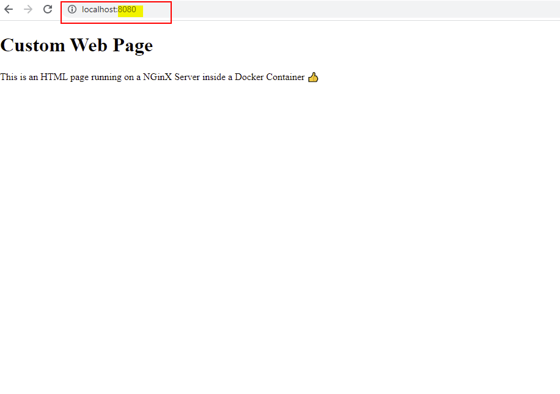

# Ports and Volume Mapping

Real world applications may need to access the container via the network or persistantly store content outside of the container. To achieve you can us the ```-p``` and ```-v ```commands 

## Example 1:

1. Pull the latest version of Nginx from ___Docker Hub___: ```docker pull nginex```
2. Run Nginx:  ```docker run -p 8080:80 nginx```
- ```-p``` allows you to map a port from your local machine to a port inside the container. In the above example the container is exposing port 80 to the local machine and NginX can be accessed by navigating to ___localhost:8080___ as in the below image


## Example 2
1. Create a file called index.html
2. From the folder where the html file is stored, run : ``` docker run -p 8080:80 -v absolut_path_to_html:/usr/share/nginx/html nginx ```
   - If you are using ___Windows___ as your OS, you need to add your variables ```${}``` eg ```docker run -p 8081:80 -v ${PWD}:/usr/share/nginx/html nginx```
   - ```-p``` maps port 8080 on your local PC to port 80 inside the container
   - ```-v``` maps the absolut path of the folder where the html file is stored to the folder inside the container. NGinX will use the following path, ___/usr/share/nginx/html___,  inside the container so its important to add this after ___:___ 
   - Notice you do not need to download the NGinX image from docker hub as we have already downloaded it in Example 1 
3. access the html page from your browser by accessing [localhost:8080](localhost:8080)
   1. The HTML file used in this example can be found [here](containers/nginx/index.html)

